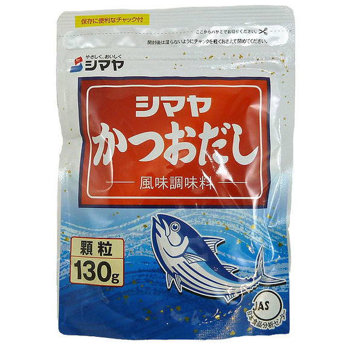
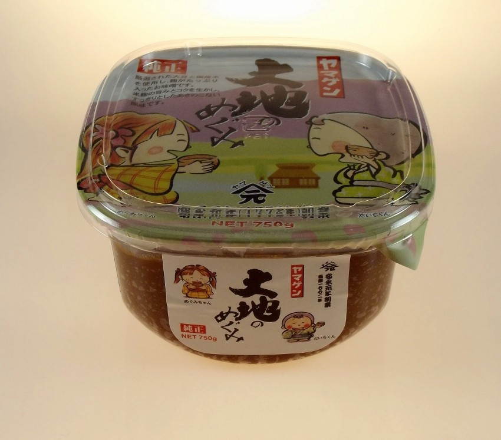

# Recette de Soupe Miso facile

La soupe miso réchauffe, elle est digeste et nutritive. Elle peut devenir un plat complet en y ajoutant des nouilles soba. Le dashi déshydraté permet de la préparer très vite.

## Ingrédients pour 2 - détails plus bas

- **600 ml d'eau** pour deux environ (2 bols)
- **Dashi déshydraté** (bouillon) : pour le mien le dosage est 1 cuillère  à café bombée pour 600 ml d'eau.
- **Pâte miso** : 1 grosse cuillère à café par personne, ajuster selon vos goûts (salé). 
- **Garniture** : quelques possibilités
  - algues wakame séchées (en épicerie asiatique). Ne pas remplacer par l'algue nori des rouleaux de printemps. j'ai essayé : l'algue nori a un goût trop fort et se désintègre dans la soupe.
  - lamelles de champignons de Paris
  - lamelles de poireau, de carotte
  - crevettes coupées en deux
  - pour transformer votre bouillon en un plat complet : nouilles soba (spaghetti fins de farine de sarrasin, en épicerie asiatique, magasin bio etc). 
  - feuilles de coriandre fraîche

## Préparation

1. Chauffer l'eau dans une casserole
2. Ajouter le dashi déshydraté, pour obtenir le bouillon
3. Quand l'eau bout, ajouter la garniture en commençant par les ingrédients les plus longs à cuire (nouilles soba puis algues qui doivent se ré-hydrater, puis légumes)
4. Dans un bol, délayer la pâte de miso avec quelques cuillères de bouillon
5. Quand la garniture a atteint la cuisson qui vous plaît (quelques minutes pour les nouilles soba, à peine une minute pour les légumes en lamelles), retirer la casserole du feu et verser le miso délayé. Le miso ne doit pas cuire, c'est pour cela qu'il faut couper la cuisson.
6. mélanger puis servir rapidement.

Le miso peut "couler" au fond, ne pas hésiter à mélanger dans la casserole juste avant de servir.

La soupe peut se réchauffer même si les puristes vous rappelleront que le miso ne doit pas bouillir. 

## Pour aller plus loin

### A propos du dashi

Le dashi est un bouillon clair, normalement préparé en faisant cuire longtemps un grand morceau d'algue konbu (varech) et des copeaux de bonite (sorte de thon) séchée. Sur le dashi déshydraté que trouve près de chez moi, le dosage n'est indiqué qu'en japonais : 1 cuillère  à café bombée pour 600 ml d'eau.

#### Préparer son dashi

Vvous pouvez préparer votre dashi. Voici [la recette dont je suis partie](https://www.lafujimama.com/how-to-make-dashi/) quand j'ai essayé: ça demande un peu de persévérance pour obtenir un bouillon ni fade, ni amer. Pour moi la différence de goût ne méritait pas le temps de travail supplémentaire, mais c'est personnel.

 Vous pouvez préparer une importante quantité de dashi, et on peut faire deux "tournées" de dashi avec les mêmes algues et copeaux de bonites.

 Il existe des recettes de dashi végétarien, en remplaçant la bonite par des champignons shiitake.

### A propos du miso

C'est une pâte de soja et de blé fermentée très salée, au goût typique de la saveur "umami", couleur beige ou brun-rouge : **1 grosse cuillère à café par personne**. Vous en trouverez en magasin bio ou diététique mais il est souvent moins cher dans les épiceries japonaises/asiatiques. Ci-dessous celui que je trouve près de chez moi. Comme il est fermenté, il se conserve très longtemps au frigo (au moins un an) dans un récipient qui ferme bien, pour peu qu'il ne soit pas souillé par d'autres aliments.

 
#### D'autres utilisations de la pâte miso

- dans une sauce pour les pâtes, avec des champignons : j'ai testé [cette recette](https://lifecurrentsblog.com/miso-tahini-pasta-with-garlic-sauteed-mushrooms/).
- [aubergines grillées au miso](https://www.assiettesgourmandes.fr/2017/07/accompagnements/aubergine-au-miso-sauce-soja-cuisine-japonaise-nasu-dengaku/)
- [saumon laqué au miso](https://www.atelierdeschefs.fr/fr/recette/31385-pave-de-saumon-d-alaska-laque-au-miso-bok-choy-caramelise.php)
- donner une partie de votre gros pot de miso à quelqu'un qui a du mal à en trouver (à la campagne)
